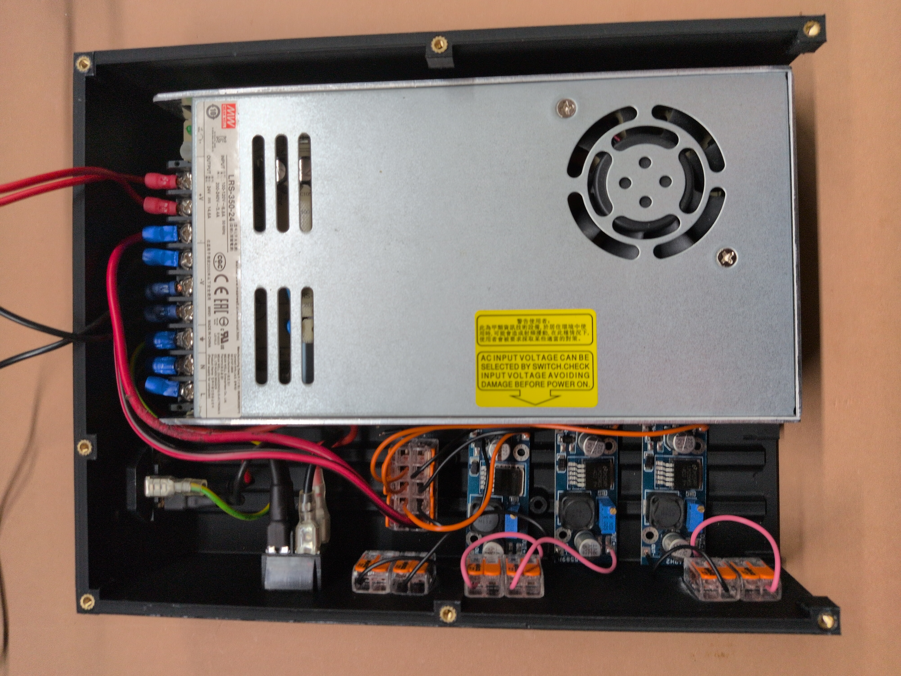
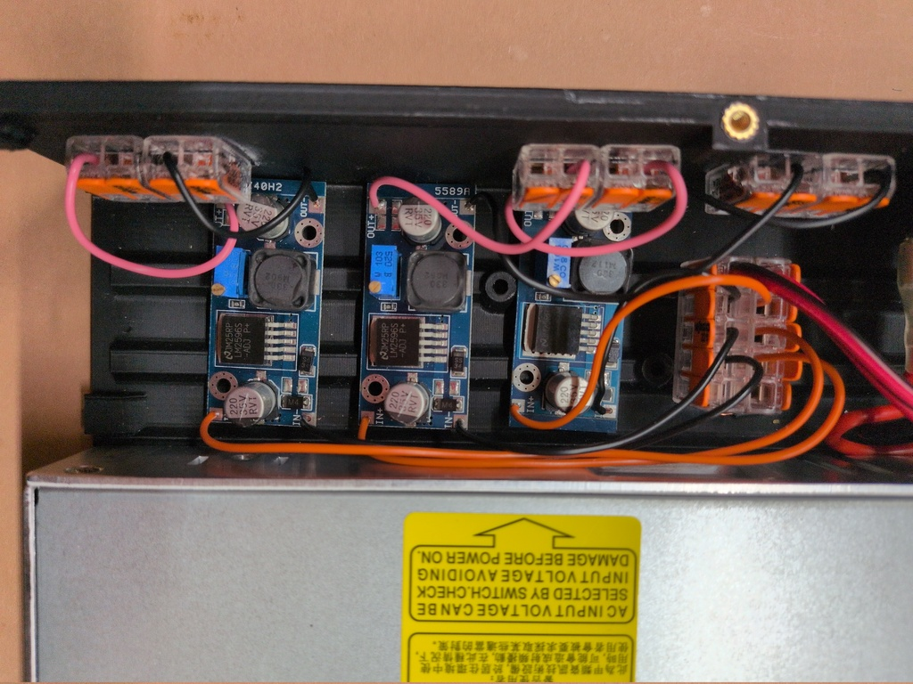

# Peltier based Cloud Chamber

# Parts

## Buy
- Power adapter 220V->24V
https://www.amazon.de/Meanwell-Biltron-Schaltnetzteil-geschlossene-Struktur/dp/B07SVH2H3G/ref=sr_1_30

- 1x CPU Cooler with Fan
https://www.amazon.de/dp/B0FMRXDHD6?ref=ppx_yo2ov_dt_b_fed_asin_title&th=1

- 1x Peltier 12709

- 1x Peltier 12715 

- 1x Low Power Voltage Converter

- 2x High Power Voltage Converter
https://www.amazon.de/dp/B09LLPQHCF?ref=ppx_yo2ov_dt_b_fed_asin_title

- Copper Plate 5x5x0.3cm
https://www.amazon.de/dp/B098RTDXQK?ref=ppx_yo2ov_dt_b_fed_asin_title&th=1

- Acrylic Case 8x8x8cm 

- Foam rubber 2mm
https://www.amazon.de/dp/B07JNZB8X1?ref=ppx_yo2ov_dt_b_fed_asin_title&th=1

- Heating Element 
https://www.amazon.de/dp/B0CTTNP7P9?ref=ppx_yo2ov_dt_b_fed_asin_title

- Felt and Magnets
https://www.amazon.de/dp/B00WLSX5QU?ref=ppx_yo2ov_dt_b_fed_asin_title&th=1

- 12x WAGO Connector 2x

- 2x WAGO Connector 5x

- 5x Low Power Switches

- Voltage Meter

- LED Spotlights
https://www.amazon.de/dp/B0F9GCK1NC?ref=ppx_yo2ov_dt_b_fed_asin_title

- Heat pads
https://www.amazon.de/dp/B0B3N7184J?ref=ppx_yo2ov_dt_b_fed_asin_title

- Screws
- Silicone
- 220V power switch
- 220V power plug
- Cables

## Print
- Case Bottom 

- Case Cover

- Case Cooler Frame

- Top Part

- Top Insulation Cover

- Top Insulation Stencil Copper 

- Top Insulation Stencil Peltier

# Schematic

# Assembly

## 1. Bottom

- Install the 220V plug and switch
- Screw in the power adapter in the bottom of the case
- Screw in the 3 low power voltage adapter
- Glue in 2 WAGO-5x connectors
- Glue in 6 WAGO-2x connectors
- Connect all parts with cables
 
 

## 2. Adjust Voltages

- Connect a voltage meter to the three low power voltage adapters and adjust them
  - 12V for the fan
 
  - 3.5V for the heating element
 
  - 5V or 12Vfor the lighting
 

## 3. Cover Under Side
- Solder cables to the low power switches
- Insert switches and voltage meter in the cover
- Glue in 7 WAGO-2x connectors
- Connect switches with WAGO connectors
- Insert power cables and voltage meter cables through cover
 

## 4. Cover Upper Side
- Rotate cover and make sure power and voltage meter cables are available
 
- Screw in high power voltage converters
- Attach cables to out connectors of voltage converters 
 

## 5. Assemble Cooling Tower

Schematic of the cooling tower:

## 6. Attach Cooling Tower
- Glue on the cooling frame
 
- Stick in the cooling tower and fan into the frame
 
 

## 7. Connect Cooling Tower
- Connect the cables from the cooling tower with the underside of the cover
  - Heating element
  - 2x Peltier element
  - Light
 

## 8. Connect Cover to Bottom
- Connect the power and ground connectors of the cover with the WAGO connectors in the bottom
 
- Stick the 24V power cables through the cover and attach then to the in connectors of the voltage converters
 
- Put cover on bottom and screw it in place

## 9. Add Heating Element
- Stick the heating element om top of the acrylic case
 

# Notes
